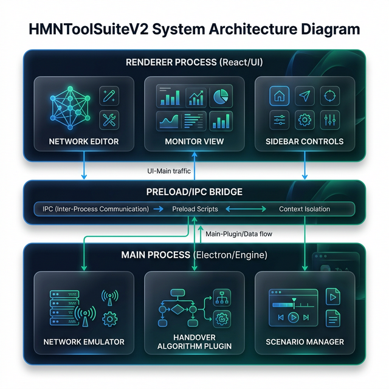

# HMNToolSuite V2 - System Design Documentation

This document outlines the architectural and conceptual design of **HMNToolSuite V2**, a modernized research platform for Vertical Handover (VHO) simulation and emulation in Heterogeneous Mobile Networks.

---

## 🎯 Requirements

### Functional Requirements
- **Interactive Topology Editing**: Users must be able to drag, drop, and configure network elements (CDMA, WLAN, WiMax) and mobile nodes.
- **Real-time Simulation**: The engine must calculate dynamic mobile node movement and evaluate handover conditions at 100ms ticks.
- **Algorithm Extensibility**: Support for multiple VHO algorithms including APAV/APSV, Context-Aware, and Random baselines.
- **Scenario Persistence**: Ability to save and load complex network scenarios as JSON files.
- **Live Monitoring**: Visualizing metric trends (RSSI, Cost, Throughput) via real-time charts.

### Non-Functional Requirements
- **Modularity**: Separation of the UI from the core logic to enable researchers to plug in new algorithms easily.
- **Performance**: High frame rate rendering for the network map and charts.
- **Cross-Platform**: Operable on macOS, Windows, and Linux.
- **Aesthetics**: Premium, modern interface to enhance researcher productivity.

---

## 🏗️ High-Level Design

HMNToolSuite V2 follows a **layered desktop architecture** using Electron's multi-process model.

1.  **Main Process (Core Engine)**: Handles Node.js native operations, the simulation loop, and file system management.
2.  **Preload Layer (IPC Bridge)**: Securely exposes authorized backend methods to the renderer.
3.  **Renderer Process (UI)**: Built with React, it manages the interactive map editor (React Flow) and the live monitor (Recharts).

---

## 🧩 Component Design

### 1. Network Emulator (`src/main/engine/NetworkEmulator.ts`)
The central simulation loop. It manages:
- **Mobility**: Updating (x, y) coordinates of mobile nodes based on velocity and defined paths.
- **Evaluation**: Triggering the VHO decision logic periodically.
- **State Broadcast**: Sending updated node/network data to the renderer via IPC.

### 2. Handover Plugin System (`IHandoverAlgorithm.ts`)
A formal interface defining the protocol for decision-making. 
- **APAV/APSV Implementation**: Implements personalized handover logic where:
    - **APAV (Access Point Acceptance Value)**: Evaluates if an AP meets minimum user requirements.
    - **APSV (Access Point Satisfaction Value)**: Ranks APs based on personalized weighting of metrics (cost, signal, power).

### 3. Scenario Manager (`src/main/io/ScenarioManager.ts`)
Handles the serialization of simulation states. It abstracts Electron's `dialog` and Node.js `fs` modules to provide a seamless "Save/Open" experience.

---

## 🛠️ Design Principles

- **Personalization over Generic Metrics**: Inspired by the research in *"Autonomic Management for Personalized Handover Decisions"*, the system prioritizes user context and preferences over simple signal strength (RSSI).
- **Separation of Concerns**: The simulation math is decoupled from the visualization colors and layouts.
- **Strictly Typed Research**: Using TypeScript interfaces for all network nodes ensures that experimental results are repeatable and the codebase is self-documenting.
- **Event-Driven UI**: The UI doesn't poll the engine; instead, it reacts to "ticks" pushed from the backend, reducing CPU overhead.

---

## 💪 Strengths & Use Cases

### Key Strengths
- **Research Portability**: Unlike legacy Java tools, it runs natively on any modern OS with a zero-configuration build process.
- **Visual Clarity**: High-fidelity icons and glassmorphic UI make complex handover transitions easy to identify and analyze.
- **Modern Extensibility**: Integrating with modern Python-based AI models or external data sources is trivial due to the underlying Node.js environment.

### Use Cases
- **Academic Research**: Validating new VHO decision algorithms against the APAV/APSV benchmark.
- **Network Planning**: Emulating how a mobile device behaves when transitioning between specific carrier towers and local private WLANs.
- **Educational Tool**: Demonstrating the concept of Heterogeneous Networks and Vertical Handover to networking students.

---

## 🚀 Future Work

- **Fuzzy Logic Integration**: Porting the full Mamdani fuzzy inference system for more nuanced handover decisions.
- **ML-Based Prediction**: Adding a TensorFlow.js layer to predict upcoming handovers based on movement patterns.
- **Collaborative Simulation**: Enabling multiple researchers to observe the same simulation state over a WebSocket connection.

---

## 🔗 References

- Kang, J. M., et al. (2011). **"Autonomic Management for Personalized Handover Decisions in Heterogeneous Wireless Networks."** Springer.
- Kang, J. M., et al. (2011). **"HMNToolSuite: Tool Support for Mobility Management..."** CNS '11.
