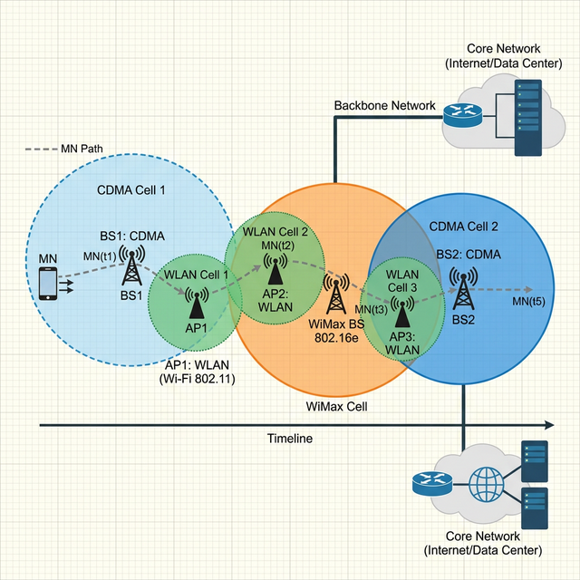

# HMNToolSuite V2 - Sample Scenarios Guide

This guide describes the reference scenarios included with HMNToolSuite V2. These scenarios are designed to validate handover algorithms in realistic heterogeneous environments, based on original peer-reviewed research.

---

## 1. Computer Networks Journal Benchmark
**File**: `scenarios/ComputerNetworks_Scenario1.json`

This is the primary test case used in the **Computer Networks (Elsevier)** journal publication. It represents a complex urban environment with multi-tier overlapping technologies.

### Objective
To evaluate how the **AUHO** algorithm coordinates decisions across **CDMA** (Macro-cell), **Wimax/Wibro** (Midi-cell), and **WLAN** (Hotspot) layers.

### Configuration
- **Macro Layer**: 3 CDMA Base Stations (BS1, BS2, BS3) providing continuous background coverage.
- **Midi Layer**: 1 WiMax Station (RAS1) providing high-bandwidth mobility support.
- **Hotspot Layer**: 3 WLAN Access Points (AP1, AP2, AP3) offering free, high-speed connectivity in specific zones.
- **Mobility**: A Mobile Node moving at **40 km/h** crossing through various overlapping regions.

### What to Look For
- Observe how AUHO prefers WLAN when available (due to cost/bandwidth) but maintains stability when moving between WLAN cells by using CDMA/WiMax as a fallback.

---

## 2. Ping-Pong Effect Test
**File**: `scenarios/PingPong_Scenario.json`

This scenario is specifically designed to demonstrate the "Ping-Pong" effect—a common problem in traditional handover where a device rapidly switches back and forth between two cells.

### Objective
To demonstrate the stability of the **AUHO** algorithm (using APSV hysteresis) compared to simple **RSS-based** handover.

### Configuration
- **Topology**: Two CDMA base stations (BS Stable and BS Fluctuating) with a large overlapping region.
- **Mobility**: A node hovering or moving slowly (5 km/h) along the boundary between the two cells.

### Comparison Task
1. Load this scenario and select the **RSS-based** policy. Notice how the node might flip-flop between networks as it moves slightly.
2. Switch to **AUHO**. Observe how the decision stays stable on the better-performing network until the other becomes significantly superior.

---

## 🚀 How to Load a Scenario
1. Open HMNToolSuite V2.
2. In the sidebar, click the **Open** button under the "Scenario File" section.
3. Navigate to the `scenarios/` directory in the project root.
4. Select the `.json` file you wish to load.
5. Click **Start** to begin the simulation.
