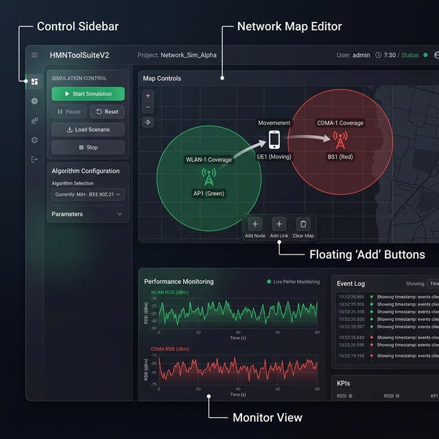

# HMNToolSuite V2 - User Manual

Welcome to **HMNToolSuite V2**, the next-generation research platform for Heterogeneous Mobile Networks. This manual provides a step-by-step guide to help you master the simulation and emulation environment.

---

## 🖥️ Interface Overview

The HMNToolSuite V2 interface is designed to provide a comprehensive view of your research environment.

1.  **Control Sidebar**: Manage simulation playback (Start/Stop), select handover algorithms, and tune parameters.
2.  **Network Map Editor**: An interactive canvas for designing network topologies.
3.  **Monitor View**: Live charts for tracking Received Signal Strength (RSSI) and other KPIs.
4.  **Floating Map Controls**: Quick buttons to add new Access Networks or Mobile Nodes.

---

## 🚀 Basic Workflow

### 1. Designing Your Network
Start by creating a heterogeneous environment.
- Click the **+ Add Access Network** button. You can choose between different technologies:
    - **CDMA / HSDPA**: Represented by a Red coverage circle.
    - **WLAN (Wi-Fi)**: Represented by a Green coverage circle.
- Drag the nodes to position them. You can overlap their coverage areas to create "Heterogeneous" zones.

### 2. Adding Mobile Nodes
- Click **+ Add Mobile Node** to place a mobile device on the map.
- You can drag the mobile node to its starting position. 
- *(Developer Note: Future versions will support path-drawing for advanced mobility).*

### 3. Selecting a Handover Policy
In the **Control Sidebar**, use the dropdown menu to select your decision logic:
- **Autonomic (AUHO)**: The advanced APAV+APSV algorithm (Recommended).
- **Context-Aware**: Decisions based on location and speed.
- **Random Baseline**: A stochastic approach for control groups.

### 4. Running the Simulation
- Click the **Start** button in the sidebar.
- Watch as the mobile node moves along its path.
- Observe the **Monitor View** at the bottom; you will see signal strengths fluctuate and handover events trigger automatically.

---

## 📂 Scenario Management

- **Saving**: Click **Save Scenario** in the sidebar to export your current map and node positions to a `.json` file.
- **Loading**: Use **Open Scenario** to restore a previous research setup.

---

## 📈 Example Use Cases

### Case 1: Analyzing the "Ping-Pong" Effect
1. Set up two overlapping CDMA base stations.
2. Place a mobile node in the middle.
3. Select the **Random** policy and observe frequent, unnecessary handovers in the Monitor View.
4. Switch to the **AUHO** policy and observe how the **APSV weighting** and **Hysteresis** stabilize the connection.

### Case 2: Personalized Vertical Handover
1. Set up one CDMA (Wide coverage, low speed) and one WLAN (Small coverage, high speed).
2. Move the mobile node into the WLAN zone.
3. In the engine configuration, set high weight for **Cost**.
4. Observe the device preferring WLAN (low cost) even if CDMA signal is currently stronger.

---

## ❓ Troubleshooting

- **Icons not visible?**: We've updated the UI to have high-contrast blue glowing icons. Ensure you are using the latest version from GitHub.
- **Simulation won't start?**: Ensure you have almeno 한 개의 Mobile Node와 한 개의 Access Network가 배치되어 있는지 확인하세요.

---

## 🔗 Additional Resources
- [System Design Document](../design/SystemDesign.md)
- [**Sample Scenarios Guide**](SampleScenarios.md)
- [Handover Algorithms Reference](AlgorithmsReference.md)
- [Developer Guide (Creating Custom Algorithms)](DeveloperGuide.md)
- [Original Research Papers](../paper/)
