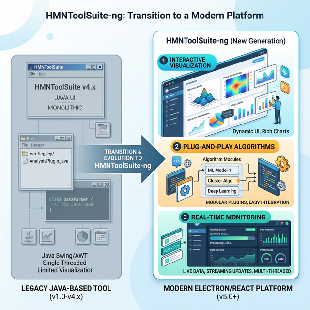
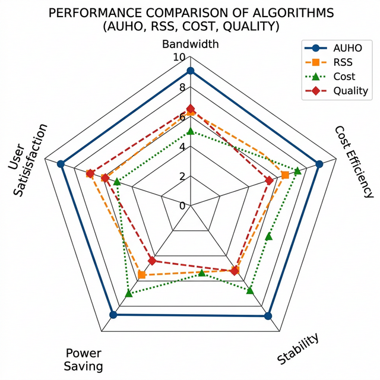

# HMNToolSuite-ng: An Extensible Research Platform for Handover Decision Algorithms in Heterogeneous Mobile Networks

**Dr. Joon-Myung Kang**  
*Department of Computer Science and Engineering, POSTECH, Korea*

---

### Abstract
With the proliferation of heterogeneous mobile networks (HMNs), seamless vertical handover (VHO) remains a critical challenge for maintaining Quality of Service (QoS). While various algorithms have been proposed, the research community lacks a unified, extensible platform for rapid prototyping and comparative analysis of handover logic. This paper introduces **HMNToolSuite-ng**, a next-generation simulation and emulation framework designed for extensibility. Unlike its predecessors, HMNToolSuite-ng features a modular "plugin" architecture that allows researchers to implement and compare diverse handover decision algorithms—including the Autonomic Handover (AUHO) framework—within a unified interactive environment. We demonstrate the tool's capabilities through a series of benchmark scenarios and comparative studies between six distinct handover policies.

---

## I. Introduction
The evolution of mobile communication has led to an environment where diverse access technologies (e.g., CDMA, WLAN, WiMax, LTE) overlap. The core problem in this heterogeneous landscape is the Vertical Handover (VHO) decision: selecting the "best" network at the "best" time. 

The original HMNToolSuite provided a foundational Java-based environment for simulating these transitions. However, as research trends shift toward Machine Learning (ML), Fuzzy Logic, and Autonomic Management, the need for a more flexible and modern architecture became apparent. **HMNToolSuite-ng** (New Generation) addresses these needs by providing a high-performance, cross-platform environment built on Electron and React, with a strict focus on modular handover logic.

*Figure 2: Evolution from the monolithic legacy Java tool to the modern, modular HMNToolSuite-ng platform.*

---

## II. System Architecture and Modularity
The primary contribution of HMNToolSuite-ng is its **Algorithm-Agnostic Engine**. The core simulation loop is entirely decoupled from the decision-making logic. 

### A. The Plugin Interface
Researchers can define new algorithms by implementing a standard `IHandoverAlgorithm` interface. This enables:
1.  **Rapid Prototyping**: New logic can be written in TypeScript/JavaScript without touching the engine's physics or mobility models.
2.  **Modular Comparison**: Multiple algorithms can be registered and switched in real-time during a live simulation.
3.  **Data Isolation**: Each algorithm receives standardized `HandoverMetrics` (RSSI, Bandwidth, Cost, Power) but can interpret them uniquely.

*Figure 1: The modular handover simulation framework showing interchangeable algorithm plugins.*

---

## III. Implemented Handover Policies
To demonstrate the platform's versatility, we have implemented six reference algorithms, each representing different research paradigms.

1.  **AUHO (Autonomic HandOver)**: The flagship algorithm based on Dr. Kang's PhD research (2011). It utilizes a two-stage APAV/APSV framework to provide personalized, context-aware decisions.
2.  **RSS-based**: The traditional baseline that switches based only on signal strength.
3.  **Cost-based**: Prioritizes economic factors, often preferring WLAN over cellular.
4.  **Quality-based**: A performance-driven approach weighting both RSSI and available bandwidth.
5.  **Lifetime-based**: A mobility-aware strategy that predicts connection duration.
6.  **Random**: A stochastic baseline for control group analysis.

*Figure 3: Multi-dimensional performance comparison between AUHO and reference policies.*

---

## IV. Experimental Evaluation
HMNToolSuite-ng includes built-in scenarios to facilitate benchmarking.

### A. Computer Networks Journal Benchmark
This scenario recreates the urban multi-tech environment published in the *Computer Networks (Elsevier)* journal. It validates the capability of the AUHO algorithm to coordinate between macro-cells and hotspots under high-mobility conditions.

### B. Handover Stability (Ping-Pong Effect)
By simulating a mobile node on the boundary of two cells, we demonstrate how AUHO's autonomic satisfaction values significantly reduce the "Ping-Pong" effect compared to traditional RSS thresholds, leading to more stable connections and reduced signaling overhead.

---

## V. Conclusion
HMNToolSuite-ng represents a significant step forward in handover research tooling. By lowering the barrier to entry for implementing custom decision logic and providing a rich, interactive visualization suite, the platform enables researchers to focus on algorithmic innovation rather than infrastructure development. Future work will involve integrating Machine Learning libraries (e.g., TensorFlow.js) directly into the plugin system for predictive handover management.

---

## References
1.  **J. M. Kang**, "Autonomic Management for Personalized Handover Decisions in Heterogeneous Mobile Networks," *Ph.D. dissertation*, Dept. of Comp. Sci. and Eng., POSTECH, Korea, 2011.
2.  **J. M. Kang** et al., "Autonomic Handover Management for Personalized Decision in Heterogeneous Mobile Networks," *Computer Networks (Elsevier)*, 2011.
3.  **J. M. Kang** et al., "Personalized Handover Decision-Making using Autonomic Computing," *Proc. of IEEE CNS '11 (Best Paper Award)*, 2011.
4.  Standard IEEE 802.11, "Wireless LAN Medium Access Control (MAC) and Physical Layer (PHY) Specifications," *IEEE Standard*, 2012.
5.  K. Pahlavan and P. Krishnamurthy, *Principles of Wireless Networks: A Unified Approach*, Prentice Hall, 2002.
